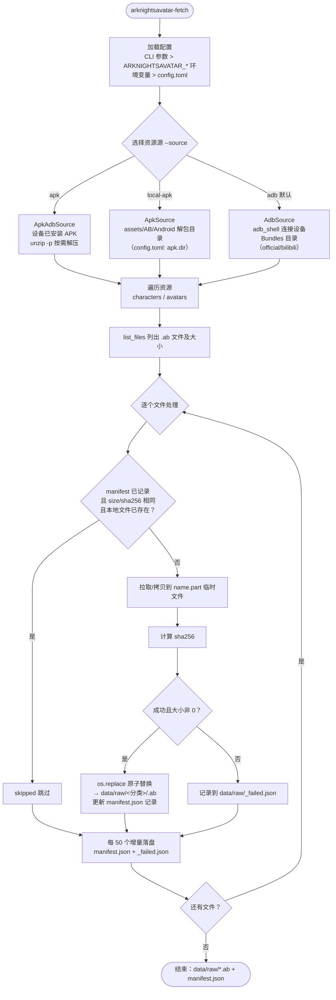
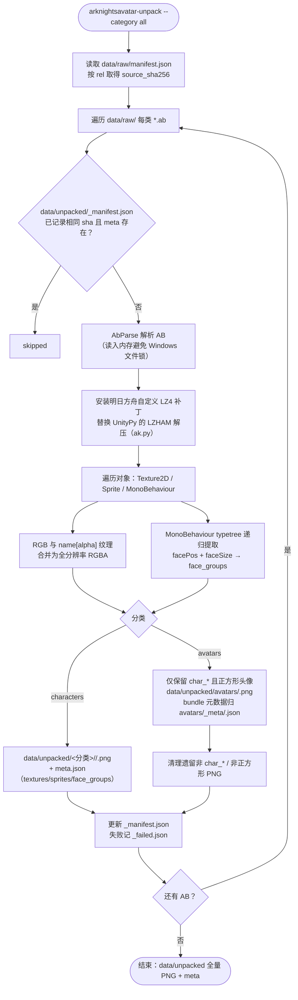
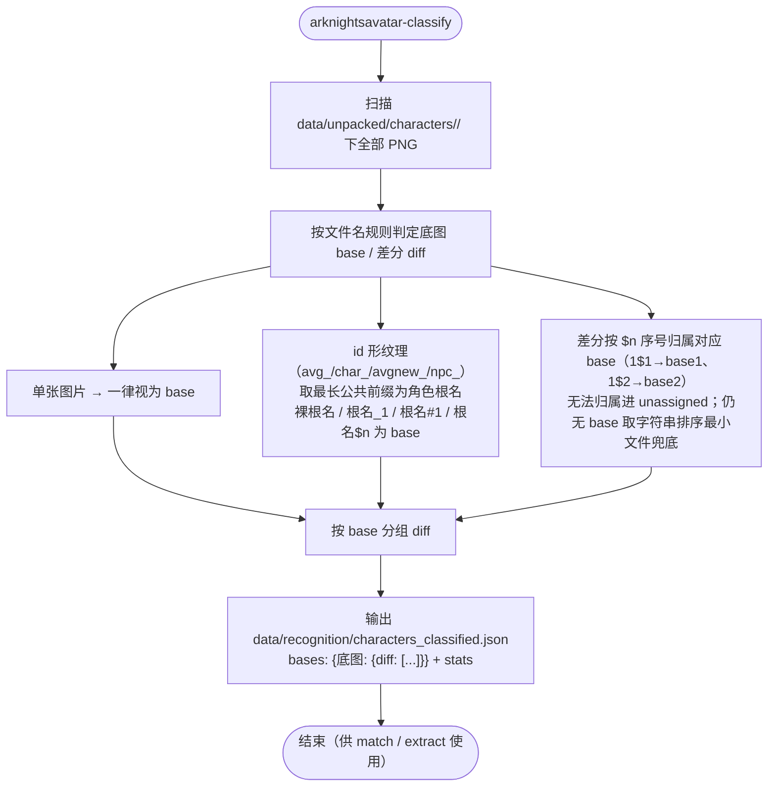
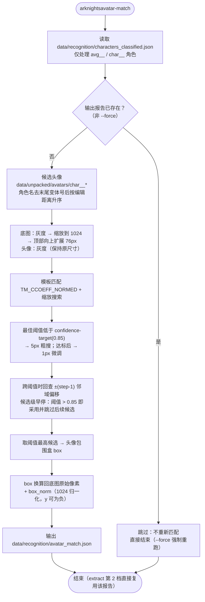
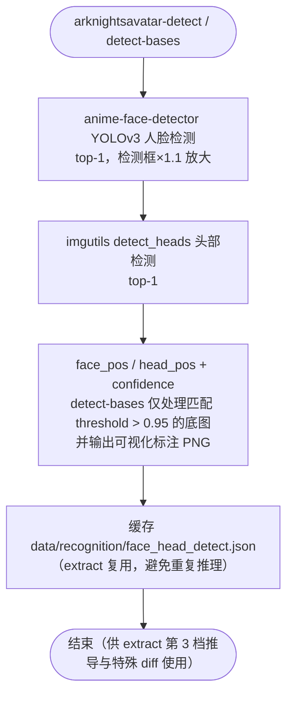
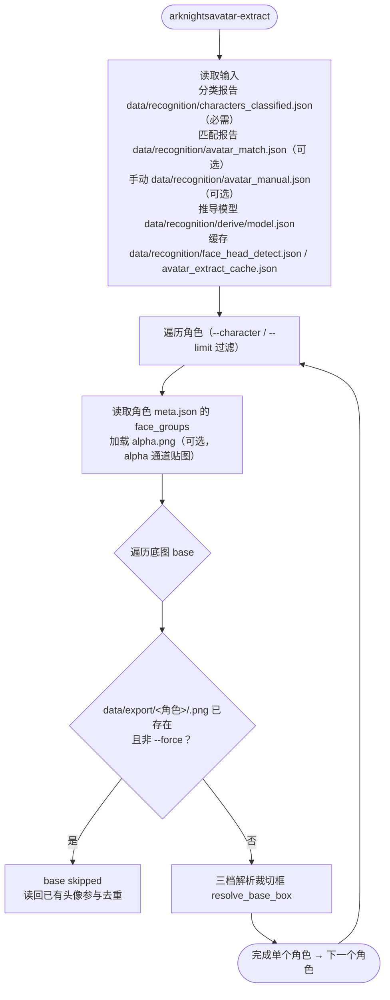
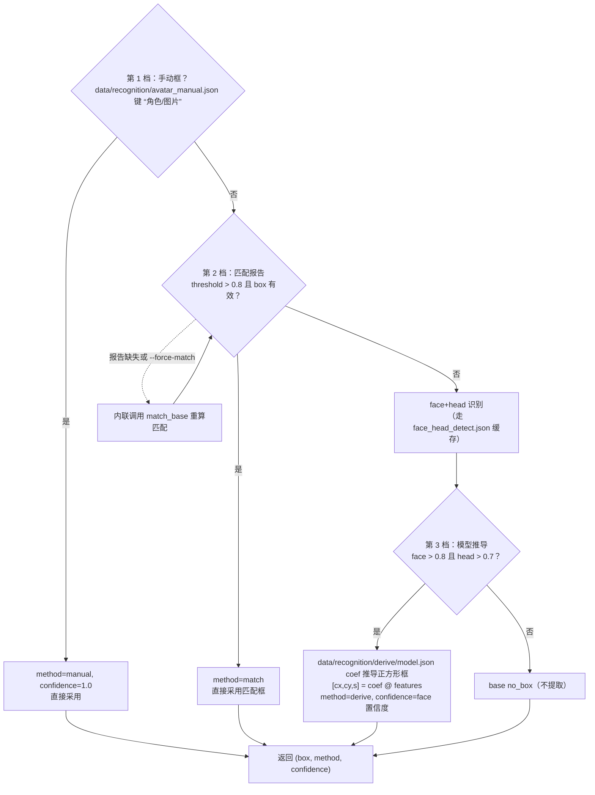
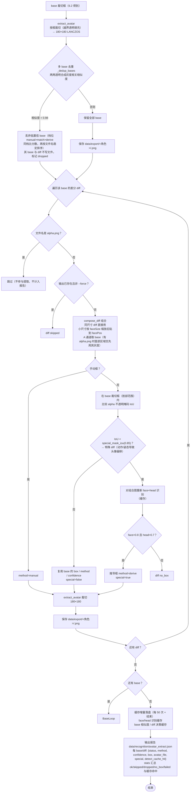
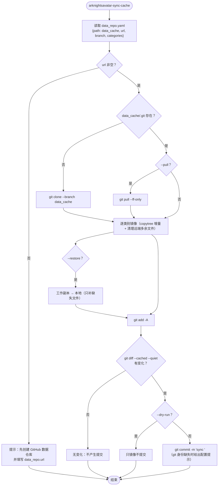

# ArknightsAvatar 生产流程图（拉取资源 → 最终 avatar 资源）

> 来源：逐模块阅读 `src/arknightsavatar/`（fetch / unpack / classify / match / detect / extract
> 及 `sources/`、`unpack/` 子模块，外加编排入口 `run / pull / produce / derive-model /
> sync-cache` 与统一入口 `cli`）。
> 阈值均为代码内实际默认值（`src/arknightsavatar/*.py` 常量）。
> 识别数据统一在 `data/recognition/`（不带 `_` 前缀），与原始 avatar、提取 avatar、
> 统计列表一起由独立 GitHub 数据仓库承载（`arknightsavatar sync-cache` 增量提交）。

## 0. 总览

```mermaid
flowchart LR
    subgraph S1["① 拉取资源 fetch"]
        A1["设备 APK 解压 / 本地 APK 解包 / ADB Bundles"] --> A2["data/raw 的 AB 缓存 + sha256 manifest"]
    end
    subgraph S2["② 解包 unpack"]
        B1["data/raw/*.ab"] --> B2["UnityPy 解析 + 明日方舟 LZ4 补丁"]
        B2 --> B3["全分辨率 RGBA PNG + meta.json（facePos/faceSize）"]
    end
    subgraph S3["③ 立绘分类 classify"]
        C1["data/unpacked/characters"] --> C2["底图 base / 差分 diff（按 base 分组）"]
    end
    subgraph S4["④ 匹配 + 识别 match / detect"]
        D1["avatars 候选头像"] --> D2["模板匹配 定位头像框 box"]
        D3["YOLOv3 人脸 + imgutils 头部"] --> D4["face_pos / head_pos"]
    end
    subgraph S5["⑤ 提取头像 extract"]
        E1["三档优先级裁切框<br/>手动 > 匹配 > 推导"] --> E2["180×180 头像 PNG"]
    end
    subgraph S6["⑥ 最终 avatar 资源生产"]
        F1["export-webp<br/>PNG → WebP（RGBA）"] --> F2["data/export_webp/<角色>/*.webp"]
        F3["npc-json<br/>扫描 export 生成索引"] --> F4["data/arknights_npc.json"]
        F5["collage<br/>差分拼贴（调试）"] --> F6["data/recognition/diff_collage/<角色>.png"]
    end
    subgraph S7["⑦ 数据仓库同步 sync-cache"]
        G1["data/recognition + avatars + export + export_webp + stats + arknights_npc.json"]
        G1 --> G2["data_cache 本地 git 工作副本"]
        G2 --> G3["git add + 增量 commit → GitHub 数据仓库"]
    end
    A2 --> B1
    B3 --> C1
    C2 --> E1
    D2 --> E1
    D4 --> E1
    E2 --> G["data/export/<角色>/<头像>.png"]
    G --> F1
    G --> F3
    G --> F5
    C2 --> G1
    D2 --> G1
    F2 --> G1
    F4 --> G1
```



---

## 0.1 编排入口

| 入口 | 步骤链 |
| --- | --- |
| `arknightsavatar run` | fetch → unpack → classify → match → extract → export-webp → npc-json（`--from`/`--until` 选段） |
| `arknightsavatar pull` | fetch（`--with-apk` 可选追加 pull-apk） |
| `arknightsavatar produce` | classify → match → extract → export-webp → npc-json（离线，不触设备） |
| `arknightsavatar derive-model` | 读 `data/recognition/face_detect_matched.json` → 最小二乘拟合 → `data/recognition/derive/{model.json, derive_coords.json, stats.json, compare/}` |
| `arknightsavatar sync-cache` | 本地数据目录 → `data_cache` 工作副本（clone/pull）→ git add + 有变化才 commit |

统一入口 `arknightsavatar <子命令>` 分发到上述编排入口与 12 个单工具；编排入口
进程内依次调用各工具的 `main(argv)`，失败中止并指明步骤，统计写入 `data/stats/`。

---

## 1. 拉取资源（fetch）— `arknightsavatar-fetch`

模块：`src/arknightsavatar/fetch.py`、`sources/base.py`、`sources/apk.py`、
`sources/apk_adb.py`、`sources/adb.py`、`sources/device.py`、`manifest.py`



产物：`data/raw/<分类>/<name>.ab`、`data/raw/manifest.json`
（`{game_version, updated_at, files:{rel:{size,sha256,source}}}`）、`data/raw/_failed.json`。

---

## 2. 解包（unpack）— `arknightsavatar-unpack`

模块：`src/arknightsavatar/unpack/unpacker.py`、`unpack/ab.py`、`unpack/ak.py`



说明：`meta.json` 中的 `face_groups`（facePos/faceSize 配对）是后面 extract 组合
小尺寸 diff 的关键元数据；`data/unpacked/_manifest.json` 与 `_failed.json` 是解包
簿记，不进 `data/recognition/`。

---

## 3. 立绘分类（classify）— `arknightsavatar-classify`

模块：`src/arknightsavatar/classify.py`



---

## 4. 头像匹配（match）— `arknightsavatar-match`

模块：`src/arknightsavatar/match.py`



---

## 5. 人脸 / 头部识别（detect）— `arknightsavatar-detect` / `arknightsavatar-detect-bases`

模块：`src/arknightsavatar/detect.py`、`detect_bases.py`



detect 报告默认 `data/recognition/face_detect.json`；detect-bases 报告默认
`data/recognition/face_detect_matched.json`（同时是 `arknightsavatar derive-model`
的输入），标注图在 `data/recognition/face_detect_vis/`。

---

## 6. 头像提取（extract）— `arknightsavatar-extract`（核心生产步骤）

模块：`src/arknightsavatar/extract.py`

### 6.1 主流程



### 6.2 裁切框三档解析（resolve_base_box）



### 6.3 提取 + 多 base 去重 + 差分提取



---

## 7. 最终 avatar 资源生产（export-webp / npc-json / collage）

模块：`src/arknightsavatar/export_webp.py`、`npc_json.py`、`collage.py`

```mermaid
flowchart TD
    Start(["data/export/<角色>/*.png"]) --> WebP["arknightsavatar-export-webp<br/>PNG 按 RGBA 解码 → WebP<br/>保持目录结构与透明通道<br/>增量：输出 .webp 已存在则跳过"]
    WebP --> WOut["data/export_webp/<角色>/*.webp"]
    Start2(["data/export/<角色>/*.png"]) --> Json["arknightsavatar-npc-json<br/>扫描各角色目录 PNG stem<br/>生成旧项目格式索引"]
    Json --> JOut["data/arknights_npc.json<br/>{<角色>: [[], [头像列表], ["npc"]]}"]
    Start3(["分类报告 + data/export"]) --> Col["arknightsavatar-collage<br/>每角色全部 diff 头像按网格拼贴<br/>黑底白格 + 文件名标注"]
    Col --> COut["data/recognition/diff_collage/<角色>.png"]
```

说明：`export-webp` 与 `npc-json` 是最终交付形态（WebP 头像 + 索引 JSON），
`collage` 为差分调试拼图，非主流程必需。

---

## 8. 数据仓库同步（sync-cache）— `arknightsavatar-sync-cache`

模块：`src/arknightsavatar/sync_cache.py`，配置：`data_repo.yaml`



四类数据映射（可在 `data_repo.categories` 调整）：

| 本地 | 数据仓库 |
| --- | --- |
| `data/recognition/` | `recognition/` |
| `data/unpacked/avatars/` | `avatars/` |
| `data/export/`、`data/export_webp/` | `export/`、`export_webp/` |
| `data/stats/`、`data/arknights_npc.json` | `stats/`、`arknights_npc.json` |

---

## 9. 磁盘契约速查

```text
data/raw/manifest.json          # {game_version, updated_at, files:{rel:{size,sha256,source}}}
data/raw/_failed.json           # 拉取失败清单
data/raw/<category>/<name>.ab   # 原始 AB 缓存

data/unpacked/_manifest.json    # {rel: source_sha256} 增量解包依据
data/unpacked/_failed.json      # 解包失败清单
data/unpacked/characters/<npc_id>/<sprite>.png + meta.json   # face_groups: facePos/faceSize
data/unpacked/avatars/<sprite>.png + _meta/<bundle>.json     # 仅 char_* 正方形头像（原始 avatar）

data/recognition/characters_classified.json  # classify 产物
data/recognition/avatar_match.json           # match 产物
data/recognition/face_detect.json            # detect 产物
data/recognition/face_detect_matched.json    # detect-bases 产物（derive-model 输入）
data/recognition/face_head_detect.json       # extract 的 face/head 识别缓存
data/recognition/avatar_extract_cache.json   # base 相似度 / diff 决策缓存
data/recognition/avatar_extract.json         # extract 提取报告
data/recognition/derive/model.json           # derive-model 产物（extract 第 3 档输入）
data/export/<npc_id>/<sprite>.png            # extract 产物：各 base/diff 的 180×180 头像
data/stats/*.json                            # 统计列表（run/produce_stats、extract_stats 等）
```

## 10. 关键阈值（代码实际默认值）

| 参数 | 默认值 | 说明 |
| --- | --- | --- |
| `--match-threshold` | 0.8 | 匹配报告 threshold 必须 > 0.8 才采用第 2 档 |
| `--face-conf` / `--head-conf` | 0.8 / 0.7 | 第 3 档模型推导的置信门槛 |
| `--special-mask-iou` | 0.85 | base 脸部范围内 alpha 掩码 IoU 低于此值判为特殊 diff |
| `--dedup-sim` | 0.98 | 多 base 头像相似度高于此值判重复，丢弃低置信 base |
| match 搜索 | 0.70 / 0.85 / 5px / 1px | stop-threshold / confidence-target / 粗搜步长 / 微调步长 |
| 导出尺寸 | 180×180 | EXPORT_SIZE |
| derive 拟合 | 0.8 | `--min-conf`：face/head 置信度严格大于该值才参与拟合 |
